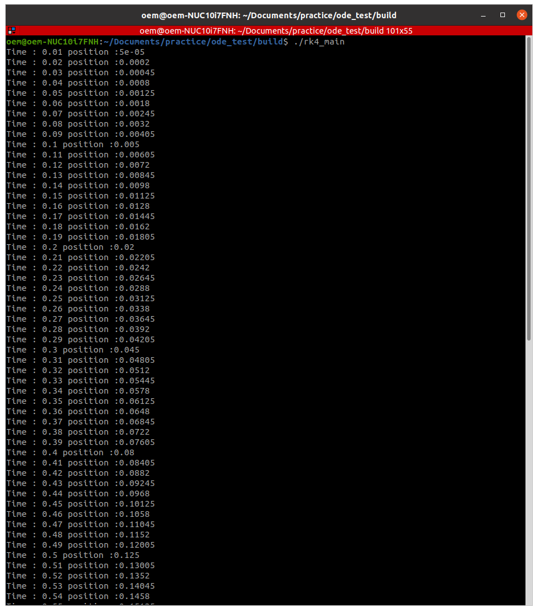

# boost_odeint_practice

Execute rk_main

```
ode_test$ mkdir build
```

```
ode_test$ cd build
```

```
ode_test/build$ cmake ..
```

```
ode_test/build$ ./rk4_main
```

Result



system dynamics

dsdt = A*s + u --> Free function

